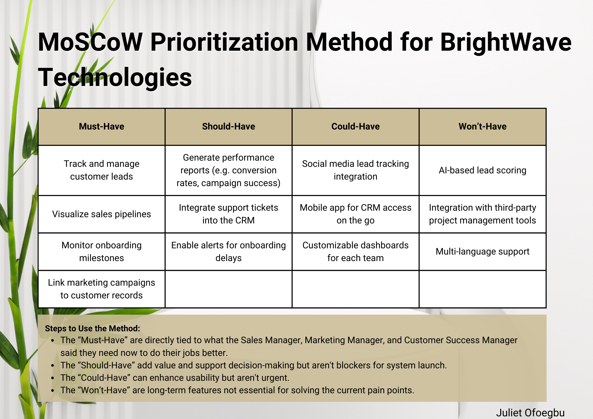
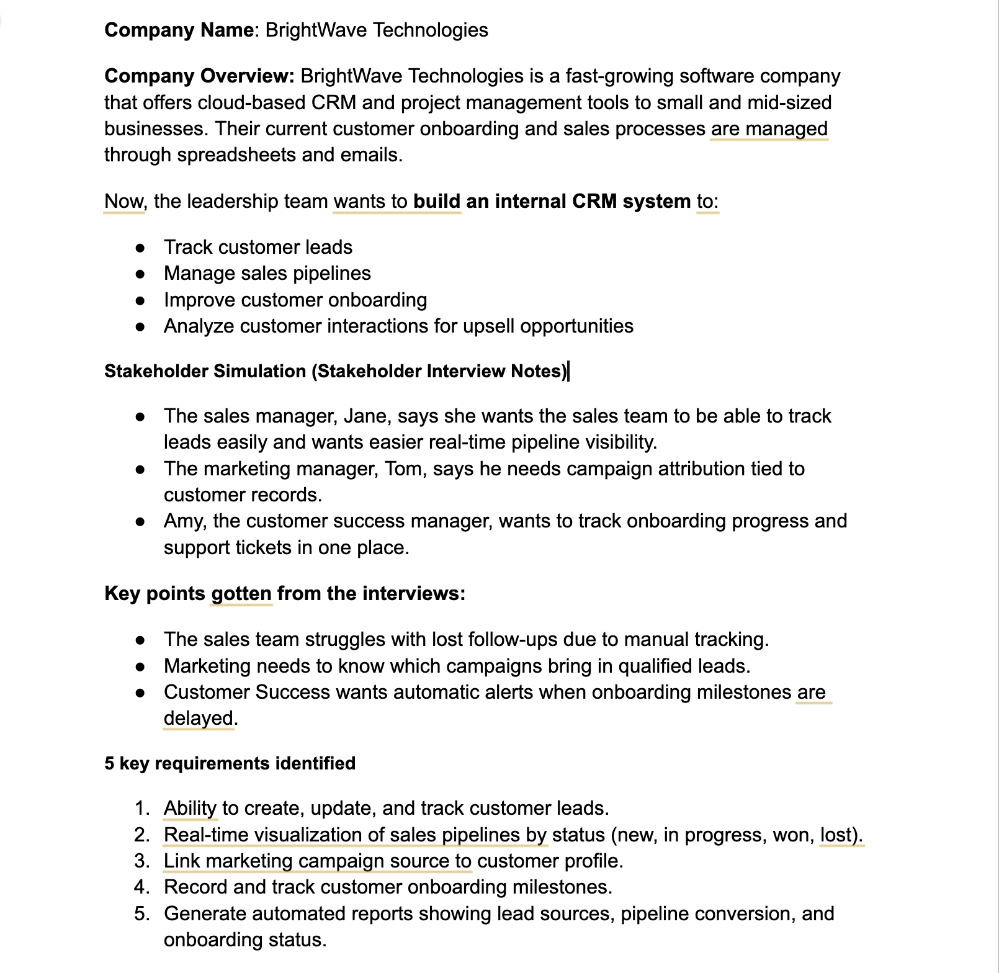
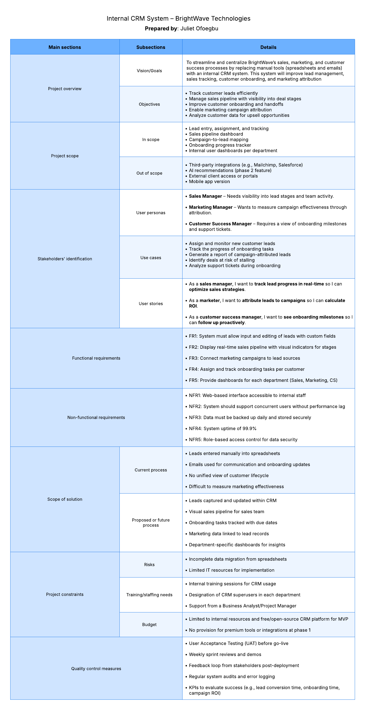
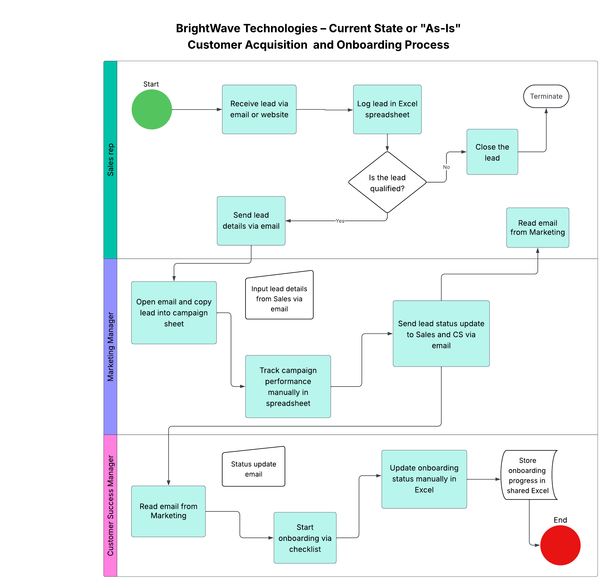
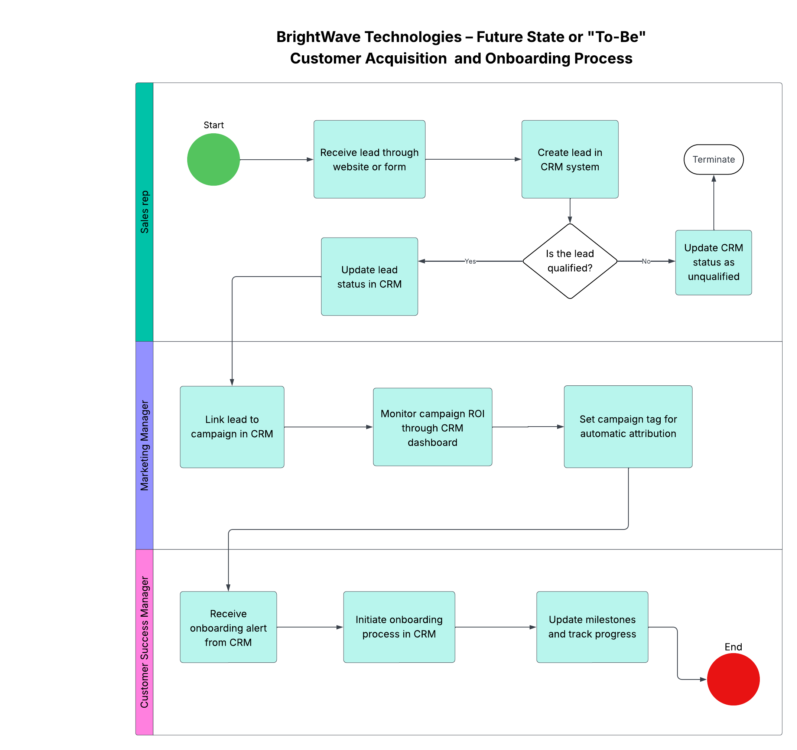

# 📁 Project Documentation: BrightWave Internal CRM System

## 📌 Project Overview

### Company's Vision and Goals

To streamline customer acquisition, sales, and onboarding workflows, BrightWave Technologies aims to develop a centralized internal **Customer Relationship Management (CRM)** system. This tool will replace disjointed spreadsheet-based tracking with an integrated solution that enhances visibility, coordination, and customer intelligence.

### Objectives

* Improve **lead tracking** and visibility across the sales pipeline.
* Unify **marketing, sales, and customer success** workflows.
* Enable efficient **customer onboarding** and support.
* Empower **data-driven decisions** through customer interaction analytics.

---

## 🔍 Process Taken

### 1. Problem Understanding

* Understood the pain points: disorganized spreadsheets, communication silos, lack of real-time updates, no unified customer view.

### 2. Stakeholder Interviews (Simulated)

Interviewed the following stakeholders:

* **Sales Manager (Jane)** – Struggles with real-time visibility of lead progress.
* **Marketing Manager (Tom)** – Wants marketing campaigns tied to lead outcomes.
* **Customer Success Manager (Amy)** – Needs a centralized view of onboarding and customer support tickets.

### 3. Requirements Gathering

Used stakeholder insights to derive:

* **Business requirements**
* **Functional & Non-functional requirements**
* **User stories**

### 4. Prioritization

Applied the **MoSCoW method** to rank requirements.

### 5. Process Modeling

Created a **BPMN diagram** to model the current and future customer acquisition process.

---

## 👥 Stakeholder Identification

### User Personas

| Persona | Role                     | Goals                        |
| ------- | ------------------------ | ---------------------------- |
| Jane    | Sales Manager            | Manage leads, track deals    |
| Tom     | Marketing Manager        | See campaign effectiveness   |
| Amy     | Customer Success Manager | Monitor onboarding & support |

### Use Cases

* Track lead status across lifecycle
* Attribute marketing sources to deals
* Visualize onboarding status
* Log customer interactions

### User Stories

* As a sales manager, I want to view my lead pipeline in real time so I can identify high-priority opportunities.
* As a marketing manager, I want to track which campaigns brought in qualified leads so I can optimize my strategy.
* As a customer success manager, I want to monitor onboarding tasks and support tickets so that no customer is left behind.

---

## ✅ Functional Requirements

| Requirement                      | MoSCoW Priority |
| -------------------------------- | --------------- |
| Lead management module           | Must-have       |
| Sales pipeline visualization     | Must-have       |
| Marketing campaign linkage       | Should-have     |
| Onboarding progress tracker      | Must-have       |
| Ticket logging & status tracking | Should-have     |
| Customer interaction history     | Could-have      |
| Reports on upsell opportunities  | Could-have      |

---

## ⚙️ Non-functional Requirements

* **Scalability**: System should support 100+ users initially.
* **Usability**: Intuitive UI for non-technical teams.
* **Security**: Role-based access control.
* **Availability**: 99.9% uptime.

---

## 🛠️ Scope of Solution

### In-Scope

* Lead and sales management
* Onboarding tracking
* Marketing attribution
* Support ticketing integration
* Reporting dashboard

### Out-of-Scope

* Billing system
* External client portal
* Social media integrations

📎 *Business Requirements Document available as a downloadable image below*

---

## 🧭 Current Process vs Future Process

### Current Process

* Disconnected spreadsheets for lead tracking
* Manual email follow-ups
* No shared visibility into onboarding or customer lifecycle

📎 *Current-state or 'As-is' state diagram for the internal CRM system for BrightWave Technologies available as a downloadable image below*

### Future Process (As Modeled in BPMN)

* Leads enter CRM automatically
* Sales tracks deals using Kanban-style boards
* Marketing inputs campaign data
* Customer success team manages onboarding milestones
* All teams access shared customer profiles

📎 *Future-state or 'To-be' state diagram for the internal CRM system for BrightWave Technologies available as a downloadable image below*

---

## ⚠️ Project Constraints

| Constraint   | Notes                                                        |
| ------------ | ------------------------------------------------------------ |
| **Risks**    | Resistance to change, data migration errors                  |
| **Training** | Required for all users                                       |
| **Budget**   | Medium-tier internal project with limited contractor support |

---

## 📊 Quality Control Measures

* User acceptance testing (UAT)
* Regular sprint demos for stakeholder feedback
* Training sessions to ensure adoption
* Post-deployment review after 1 month

---

## 📦 Deliverables

| Deliverable                              | Description                                              |
| ---------------------------------------- | -------------------------------------------------------- |
| Stakeholder Interview Summary            | Simulated notes and key insights                         |
| Business Requirements                    | High-level goals the system must achieve                 |
| Functional & Non-functional Requirements | Technical and operational expectations                   |
| User Stories                             | End-user needs defined in simple terms                   |
| MoSCoW Prioritization Matrix             | Sorted requirement priorities                            |
| BPMN Diagram                             | Visual of the future-state customer acquisition workflow |
| Business Requirements Document (BRD)     | Full consolidated documentation of the above             |

---

## 🎯 Business Analysis Techniques Applied

| Technique                         | Purpose                      |
| --------------------------------- | ---------------------------- |
| Stakeholder Interview (Simulated) | Requirement elicitation      |
| User Story Creation               | Capture user needs           |
| MoSCoW Prioritization             | Prioritize features          |
| BPMN Diagramming                  | Visualize workflows          |
| Use Case Development              | Describe system interactions |

---

## 🧠 Skills Practiced & Learned

| Skill                      | Application                                    |
| -------------------------- | ---------------------------------------------- |
| Requirements Elicitation   | Through stakeholder simulation                 |
| Requirement Prioritization | Using MoSCoW method                            |
| Process Modeling           | With BPMN to visualize workflows               |
| Documentation              | Built a formal BRD                             |
| Stakeholder Communication  | Simulated mapping and engagement               |
| Analytical Thinking        | Translating needs into structured requirements |
| Tooling                    | Used Lucidchart for BPMN and BRD               |

---

## 🧾 Summary

This internal CRM project for BrightWave Technologies allowed me to simulate real-world business analysis work, from understanding organizational goals to translating stakeholder insights into a prioritized and structured business solution. It provided a solid foundation in stakeholder engagement, requirements engineering, and business process modeling.
